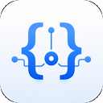
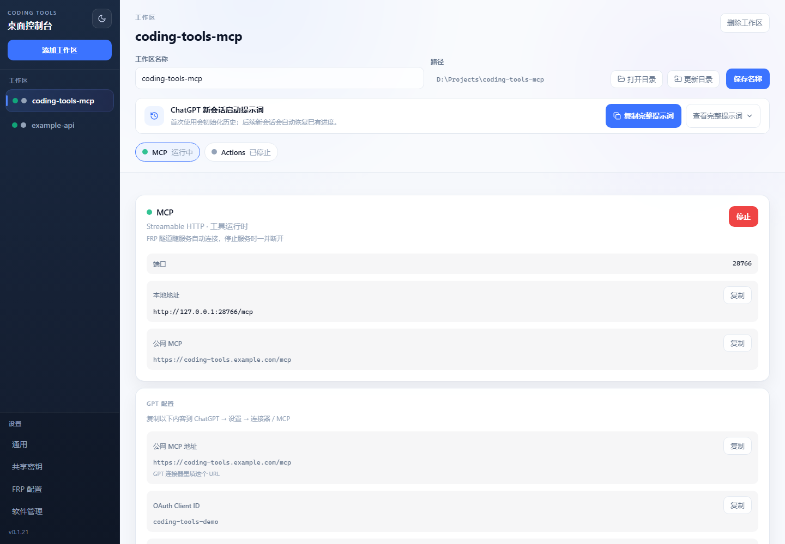
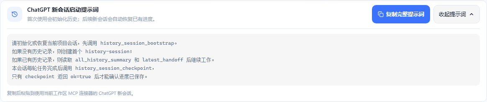
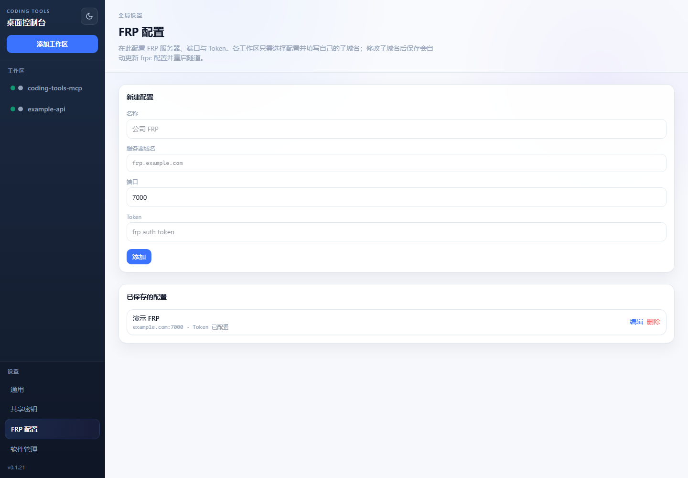
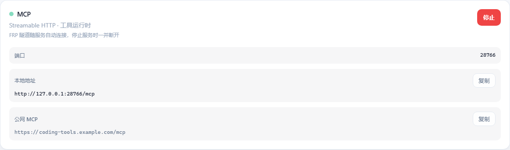
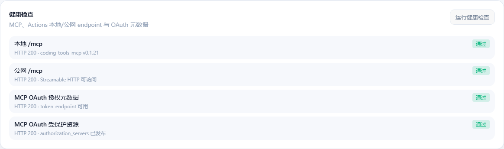
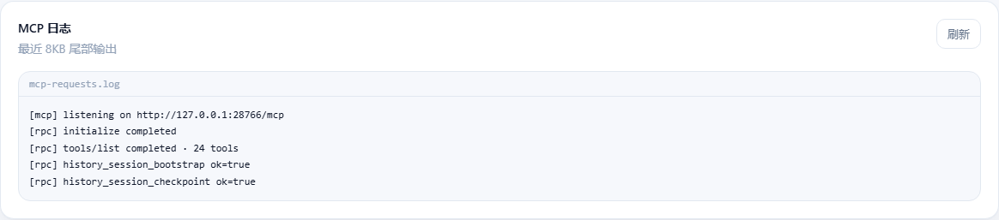

<p align="center">
  
</p>

<h1 align="center">Coding Tools MCP</h1>

<p align="center">
  Turn a local project into a persistent AI development workspace that carries context across conversations.
</p>

<p align="center">
  <a href="https://github.com/mybolide/coding-tools-mcp/releases/latest"></a>
  
  
  <a href="https://www.apache.org/licenses/LICENSE-2.0"></a>
</p>

<p align="center">
  <a href="README.md">中文</a> · <a href="README.en.md">English</a> · <a href="https://github.com/mybolide/coding-tools-mcp/releases/latest">Download latest</a>
</p>

Coding Tools MCP is a Rust + Tauri 2 desktop application. Select a project directory and start the service; an AI agent can then read files, edit code, run commands and tests, inspect Git, and preserve development progress inside the project through MCP. It behaves like an AI opening an IDE workspace that remembers where the last conversation stopped.



*One desktop app manages workspaces, MCP services, connection details, and the session-recovery prompt.*

## Why use it

- **Built for real development**: files, commands, Git, tests, and retained processes live in one Workspace.
- **Cross-conversation continuity**: a new conversation can recover the complete history summary and the latest detailed handoff.
- **Auditable progress**: structured checkpoints preserve decisions, changed files, test results, remaining issues, and next steps inside the project.
- **Multiple workspaces**: one desktop client stores multiple projects and manages their MCP, Actions, and public endpoints.
- **Direct ChatGPT connectivity**: Streamable HTTP, OAuth, Bearer tokens, OpenAPI, FRP, and Cloudflare are built in.
- **A focused default tool surface**: stable core tools are available by default; advanced Harness capabilities are opt-in.

## Let the project remember every conversation

Chat transcripts are useful for rereading a discussion, but they are a poor long-term development handoff. Coding Tools MCP stores progress in `docs/history-session/` under the current project, so context follows the repository instead of staying trapped in one chat window.



*Paste the full prompt into a new conversation to initialize or restore history, then save a checkpoint after each completed task.*

Three tools work together:

| Tool | Purpose |
| --- | --- |
| `history_session_bootstrap` | Initialize or restore a project session when a conversation starts; create history on first use, or return the full summary and latest detailed handoff |
| `history_session_checkpoint` | Save structured progress after a task, including goals, findings, decisions, changed files, tests, remaining issues, and next steps |
| `history_session_validate` | Validate numbering, history files, and session mappings; rebuild derived indexes when needed without deleting existing history |

History uses readable Markdown that can be backed up or committed with the project. Checkpoints are idempotent, and progress should only be reported as saved after the tool returns `ok=true`.

> History persistence is performed when the AI calls the MCP tools; the desktop app does not record chat content in the background. If the client does not invoke a tool, the server cannot infer that a new conversation or task has happened.

## Get started in five minutes

### 1. Install the desktop client

Open [Releases](https://github.com/mybolide/coding-tools-mcp/releases/latest) and download the package for your platform:

| Platform | Package |
| --- | --- |
| Windows 10/11 x64 | `Coding.Tools.MCP_*_x64-setup.exe` |
| macOS Apple Silicon | `Coding Tools MCP_*_aarch64.dmg` |

The macOS build is currently unsigned. If macOS blocks the first launch, allow it from System Settings → Privacy & Security.

### 2. Add a project workspace

1. Click **Add workspace** in the sidebar.
2. Select the project root directory.
3. Configure the workspace name, MCP port, and authentication mode.
4. Save it. The workspace remains available in the sidebar across conversations and restarts.

### 3. Configure a public tunnel

When the AI client is not running on the same machine, expose MCP through HTTPS:

- Install or detect `frpc` / `cloudflared` from **Software management**.
- Save the server, port, and token under **FRP settings**, or select Cloudflare in the workspace.
- Give each workspace a distinct subdomain. The app manages the FRP process and aggregates multiple proxy routes.



*FRP server profiles are stored centrally; each workspace only selects a profile and supplies its own subdomain.*

If you do not have an FRPS server yet, follow this [FRPS server installation guide (Chinese, WeChat)](https://mp.weixin.qq.com/s/kmpQhHsvmHlaLfj4rw3A0Q). After deployment, enter the server address, port, and token under **FRP settings** in the desktop client.

### 4. Start MCP

Open the workspace and click **Start** in the MCP panel. The desktop client shows:

- a local MCP URL such as `http://127.0.0.1:28766/mcp`;
- the public HTTPS MCP URL;
- authentication details for ChatGPT;
- live logs and health-check results.



The desktop app can verify the local and public endpoints, OAuth metadata, and the MCP protected-resource document:



*Each connectivity and authentication check reports its result separately.*

When a connection fails, inspect recent MCP requests without leaving the desktop app:



*The log quickly confirms whether tool discovery, history bootstrap, and checkpoint calls reached the server.*

### 5. Connect an AI client

Use the public MCP URL shown by the app. With OAuth enabled, the client follows the server metadata into the authorization flow; authorization codes, Client IDs, and secrets can be generated and managed from the desktop client. This release uses preconfigured OAuth clients, so select static/manual OAuth credentials when creating a ChatGPT plugin; CIMD is not required.

For a first connection, ask the agent to initialize history before inspecting the workspace:

```text
history_session_bootstrap
server_info
get_default_cwd
git_status
check_exec_environment
```

This gives the agent explicit project and capability state instead of guessing from the current chat window.

## Two ways to connect ChatGPT

| Mode | Best for | Use this endpoint |
| --- | --- | --- |
| MCP Connector | Direct access to files, commands, and Git | the workspace's public `/mcp` URL |
| GPT Actions | Importing OpenAPI tools into a custom GPT | the Actions panel's `/openapi.json` URL |

### MCP Connector

1. Start the workspace MCP service and public tunnel.
2. Create a connection in ChatGPT's Connector/MCP settings.
3. Paste the public MCP URL shown by the desktop app.
4. Complete None, Bearer, or OAuth authentication as configured.

### GPT Actions

1. Start the workspace Actions service.
2. Copy the OpenAPI URL from the Actions panel.
3. Import the URL in the GPT editor's Actions page.
4. Select None, API Key, or OAuth to match the desktop configuration.

MCP and Actions can run together for the same workspace, with separate ports and subdomains when needed.

## What an agent can do

The default `core` profile provides a stable, composable development tool set:

| Category | Main tools |
| --- | --- |
| File reading | `read_file`, `list_dir`, `list_files`, `search_text`, `grep_text`, `view_image` |
| File modification | `apply_patch` |
| Command execution | `exec_command`, `write_stdin`, `read_output`, `kill_session` |
| Git | `git_status`, `git_diff`, `git_log`, `git_show`, `git_blame` |
| Environment | `server_info`, `check_exec_environment`, `get_default_cwd`, `set_default_cwd` |
| History sessions | `history_session_bootstrap`, `history_session_checkpoint`, `history_session_validate` |

A typical development loop is:

```text
Open Workspace
  → understand project and Git state
  → search and read code
  → apply a transactional patch
  → run commands and tests
  → inspect the diff and commit
```

The advanced profile retains project-state and operation-history Harness capabilities, but normal edits and command execution do not require a Task.

## Permission and recovery model

The project uses a Workspace-first permission model:

- Normal files inside the Workspace can be read, created, modified, deleted, and executed.
- Outside the Workspace, `read_file`, `list_dir`, `list_files`, `search_text`, and `view_image` provide read-only access.
- Writes, deletes, and command execution outside the Workspace are blocked.
- `.git` and `.github` cannot be damaged through ordinary file tools, Patch, or interpreter commands.
- Patch performs preflight validation and operation-local recovery; long-term recovery uses Git instead of full Workspace snapshots.

> Windows child-process execution currently uses a `policy_only` boundary. The honest runtime value is `sandbox_enforced: false`; static command policy is not a complete OS filesystem sandbox.

## Local development

Requirements: Node.js 20+, Rust stable, and the [Tauri 2 prerequisites](https://v2.tauri.app/start/prerequisites/) for your platform.

```bash
npm install
npm run desktop
```

Useful verification commands:

```bash
npm run check
npm run build
cd src-tauri && cargo test
cd src-tauri && cargo clippy --all-targets -- -D warnings
```

On Windows, you can also run `dev-desktop.cmd`. Do not use `npm run dev` alone to validate the desktop application; it starts Vite without the Tauri shell.

## Project layout

| Path | Purpose |
| --- | --- |
| `src-tauri/src/tools/` | Shared file, Patch, Exec, and Git tool kernel |
| `src-tauri/src/mcp/` | MCP Streamable HTTP server |
| `src-tauri/src/actions/` | ChatGPT Actions OpenAPI gateway |
| `src-tauri/src/tunnel/` | FRP / Cloudflare tunnel and process management |
| `src/` | SvelteKit desktop UI |
| `old/` | Python reference implementation and compatibility baseline |

## License

[Apache-2.0](https://www.apache.org/licenses/LICENSE-2.0)
