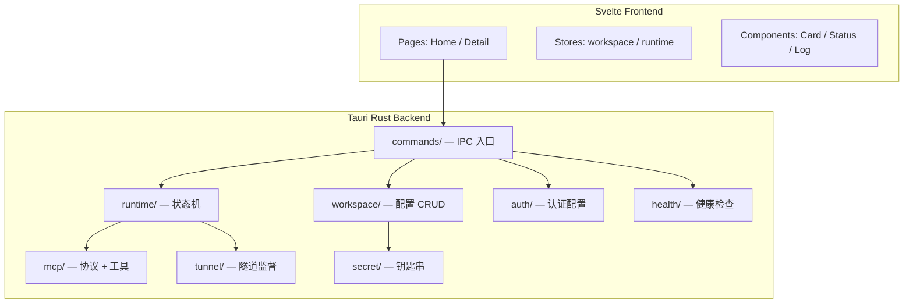

# 设计文档：rust-desktop-client

## 概述

用 Tauri 2 + Svelte 构建跨平台桌面客户端，Rust 后端内嵌 MCP 核心。本设计覆盖 requirements.md 全部 FR-1 至 FR-10 及 NFR-1 至 NFR-4。

**对应需求:** FR-1, FR-2, FR-3, FR-4, FR-5, FR-6, FR-7, FR-8, FR-9, FR-10, NFR-1, NFR-2, NFR-3, NFR-4

---

## 技术方案

### 技术选型

| 类别 | 选择 | 理由 | 关联需求 |
|------|------|------|----------|
| 桌面壳 | Tauri 2 | 跨平台、单二进制、Rust 后端 | FR-1, NFR-3 |
| 前端 | Svelte + TypeScript + TailwindCSS | 轻量、现代 UI、开发效率高 | FR-1, FR-10 |
| MCP 协议 | rmcp + axum | Rust 原生 MCP SDK + HTTP server | FR-3, FR-4 |
| 异步 | tokio | 进程监督、HTTP、异步 I/O | FR-3, FR-5 |
| Git | git2 | git_status / git_diff 工具 | FR-4 |
| 密钥 | keyring crate | 系统钥匙串集成 | FR-7, NFR-2 |
| 配置 | serde_json + 文件 | Workspace 配置持久化 | FR-2 |

### 架构设计



---

## 数据模型

### WorkspaceProfile

| 字段 | 类型 | 约束 | 说明 |
|------|------|------|------|
| id | String (UUID) | 唯一 | Workspace 标识 |
| name | String | 非空 | 显示名称 |
| path | String | 存在的目录 | 项目根目录 |
| runtime.local_port | u16 | 1024-65535 | MCP 监听端口，默认 28766 |
| runtime.tool_profile | enum | full / read-only | 工具暴露策略 |
| runtime.permission_mode | enum | safe / trusted / dangerous | 权限模式 |
| tunnel.type | enum | frp / cloudflare / none | 隧道类型 |
| tunnel.frp_server | String | FRP 时必填 | FRP 服务器域名 |
| tunnel.frp_subdomain | String | FRP 时必填 | FRP 子域名 |
| tunnel.cloudflare_mode | enum | quick / named | Cloudflare 模式 |
| tunnel.public_url | String | named 时必填 | 固定公网地址 |
| auth.type | enum | oauth / bearer / noauth | 认证模式 |

密钥字段（oauth_client_secret, oauth_password, bearer_token, cloudflare_token）存储在系统钥匙串，不出现在 JSON 配置中。

### RuntimeState（状态机）

```rust
enum RuntimeState {
    Stopped,
    Starting { since: Instant },
    Running { port: u16, started_at: Instant },
    Stopping,
    Error { message: String, since: Instant },
}
```

| 状态 | 允许操作 | 转换条件 |
|------|----------|----------|
| Stopped | start | 用户点击启动 |
| Starting | — | HTTP server 绑定端口成功 → Running；超时/错误 → Error |
| Running | stop, health_check | 用户点击停止 → Stopping |
| Stopping | — | HTTP server 关闭完成 → Stopped |
| Error | start, stop | 用户重试 → Starting；用户停止 → Stopped |

---

## API 设计（Tauri Commands）

| 命令 | 签名 | 入参 | 出参 | 关联需求 |
|------|------|------|------|----------|
| list_workspaces | async fn() | — | Vec\<WorkspaceProfile\> | FR-1, FR-2 |
| create_workspace | async fn(path, name) | path: String, name: Option\<String\> | WorkspaceProfile | FR-2 |
| update_workspace | async fn(profile) | profile: WorkspaceProfile | () | FR-2 |
| delete_workspace | async fn(id) | id: String | () | FR-2 |
| start_runtime | async fn(id) | id: String | RuntimeStatus | FR-3 |
| stop_runtime | async fn(id) | id: String | RuntimeStatus | FR-3 |
| get_runtime_status | async fn(id) | id: String | RuntimeStatus | FR-3 |
| start_tunnel | async fn(id) | id: String | TunnelStatus | FR-5 |
| stop_tunnel | async fn(id) | id: String | () | FR-5 |
| run_health_checks | async fn(id) | id: String | Vec\<HealthItem\> | FR-8 |
| get_logs | async fn(id, source) | id: String, source: LogSource | String | FR-9 |
| copy_to_clipboard | async fn(text) | text: String | () | FR-10 |

---

## 文件结构

```
coding-tools-mcp-rust/
├── src-tauri/
│   ├── src/
│   │   ├── main.rs
│   │   ├── lib.rs
│   │   ├── commands/
│   │   │   ├── mod.rs
│   │   │   ├── workspace.rs
│   │   │   ├── runtime.rs
│   │   │   ├── tunnel.rs
│   │   │   ├── health.rs
│   │   │   └── clipboard.rs
│   │   ├── workspace/
│   │   │   ├── mod.rs
│   │   │   ├── model.rs
│   │   │   └── store.rs
│   │   ├── runtime/
│   │   │   ├── mod.rs
│   │   │   └── state_machine.rs
│   │   ├── mcp/
│   │   │   ├── mod.rs
│   │   │   ├── server.rs
│   │   │   ├── tools/
│   │   │   │   ├── mod.rs
│   │   │   │   ├── file.rs
│   │   │   │   ├── patch.rs
│   │   │   │   ├── exec.rs
│   │   │   │   └── git.rs
│   │   │   └── workspace.rs
│   │   ├── tunnel/
│   │   │   ├── mod.rs
│   │   │   ├── frp.rs
│   │   │   └── cloudflare.rs
│   │   ├── auth/
│   │   │   ├── mod.rs
│   │   │   └── oauth.rs
│   │   ├── secret/
│   │   │   ├── mod.rs
│   │   │   └── keyring_store.rs
│   │   └── health/
│   │       ├── mod.rs
│   │       └── checker.rs
│   ├── Cargo.toml
│   └── tauri.conf.json
├── src/
│   ├── routes/
│   │   ├── +page.svelte
│   │   └── workspace/[id]/+page.svelte
│   ├── lib/
│   │   ├── components/
│   │   │   ├── WorkspaceCard.svelte
│   │   │   ├── StatusBadge.svelte
│   │   │   ├── HealthPanel.svelte
│   │   │   ├── LogViewer.svelte
│   │   │   └── ConfigForm.svelte
│   │   └── stores/
│   │       ├── workspaces.ts
│   │       └── runtime.ts
│   ├── app.html
│   └── app.css
├── tests/
│   └── compliance/
│       ├── mod.rs
│       ├── mcp_contract.rs
│       ├── tool_golden.rs
│       └── security.rs
├── package.json
├── svelte.config.js
├── vite.config.ts
└── tailwind.config.js
```

---

## 设计决策

### 决策 1: 内嵌 MCP 而非外部进程（关联需求: FR-3, FR-4）

**问题**: 旧版通过 subprocess 启动外部 Python MCP，导致 PID 猜测、状态不一致等 bug。

**选项**:
1. 继续外部进程，改进进程管理
2. 内嵌 Rust MCP 核心到 Tauri 后端

**决策**: 选择选项 2

**理由**: 消除最大 bug 源；单二进制分发；状态机可直接管理 HTTP server 生命周期

### 决策 2: Svelte 而非 React（关联需求: FR-1）

**问题**: 前端框架选择

**选项**:
1. React + TypeScript
2. Svelte + TypeScript

**决策**: 选择选项 2

**理由**: 更轻量、编译时优化、与 Tauri 生态配合好、适合工具型 UI

### 决策 3: Phase 1 仅 P0 工具子集（关联需求: FR-4）

**问题**: 17 个 MCP 工具是否一次性实现

**选项**:
1. 全部 17 个工具
2. P0 子集（11 个）+ 后续迭代

**决策**: 选择选项 2

**理由**: 先跑通端到端链路，用合规测试验证核心行为，降低首次交付风险

### 决策 4: 钥匙串存储密钥（关联需求: FR-7, NFR-2）

**问题**: 密钥持久化方式

**选项**:
1. 独立 secrets.json（旧版方式）
2. 系统钥匙串

**决策**: 选择选项 2

**理由**: 旧版明文存储是安全隐患；系统钥匙串是桌面应用标准做法

---

## UI 设计

完整 UI 规格见 [`ui-design.md`](./ui-design.md)，设计系统见 [`docs/design-system.md`](../../design-system.md)。

### 视觉方向

- **风格**: Refined Utilitarian（参考 Linear / Raycast / Vercel）
- **默认主题**: 深色，支持浅色切换
- **字体**: Plus Jakarta Sans（UI）+ JetBrains Mono（代码/URL）
- **强调色**: 单一靛蓝 indigo，状态色独立编码
- **布局**: Sidebar + 主画布，Workspace 卡片首页，详情渐进披露

### 关键 UI 组件

AppShell, WorkspaceCard, StatusOrb, ConnectionPanel, HealthPanel, ConfigPanel, LogViewer, CopyButton

---

## 测试策略

| 测试类型 | 覆盖范围 | 验证方式 |
|----------|----------|----------|
| Rust 单元测试 | 数据模型、状态机转换、路径校验 | cargo test |
| MCP 合规测试 | P0 工具行为、协议契约 | tests/compliance/ 对照 old/ 基线 |
| 安全测试 | 路径穿越、命令注入 | tests/compliance/security.rs |
| 集成测试 | 启动→调用工具→停止 全流程 | cargo test --test integration |
| 手动测试 | UI 交互、隧道连接、剪贴板 | 验收标准逐条核对 |

---

## 风险评估

| 风险 | 影响 | 缓解措施 |
|------|------|----------|
| rmcp crate 不成熟 | 高 | 评估 API 稳定性；必要时直接用 axum 实现 MCP 协议 |
| Windows 进程管理差异 | 中 | 优先在 Windows 开发和测试；tokio::process 跨平台 |
| 合规测试移植工作量大 | 中 | Phase 1 仅移植 P0 工具相关测试 |
| Cloudflare 隧道 URL 解析 | 低 | 参考旧版 regex 逻辑，增加超时和重试 |
| git2 与系统 git 行为差异 | 低 | 对照 old/ git 工具测试验证 |

---

## 检查清单

- [x] 技术方案与现有架构一致
- [x] requirements.md 中每条 FR 都被本设计覆盖
- [x] 文件结构对照真实代码库规划
- [x] 数据模型 / 接口契约清晰
- [x] 关键设计决策已记录并关联需求
- [x] 测试策略可验证验收标准
